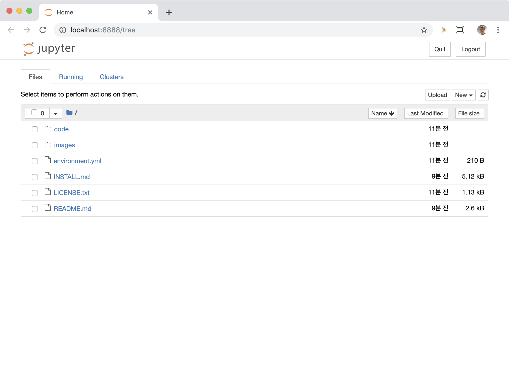
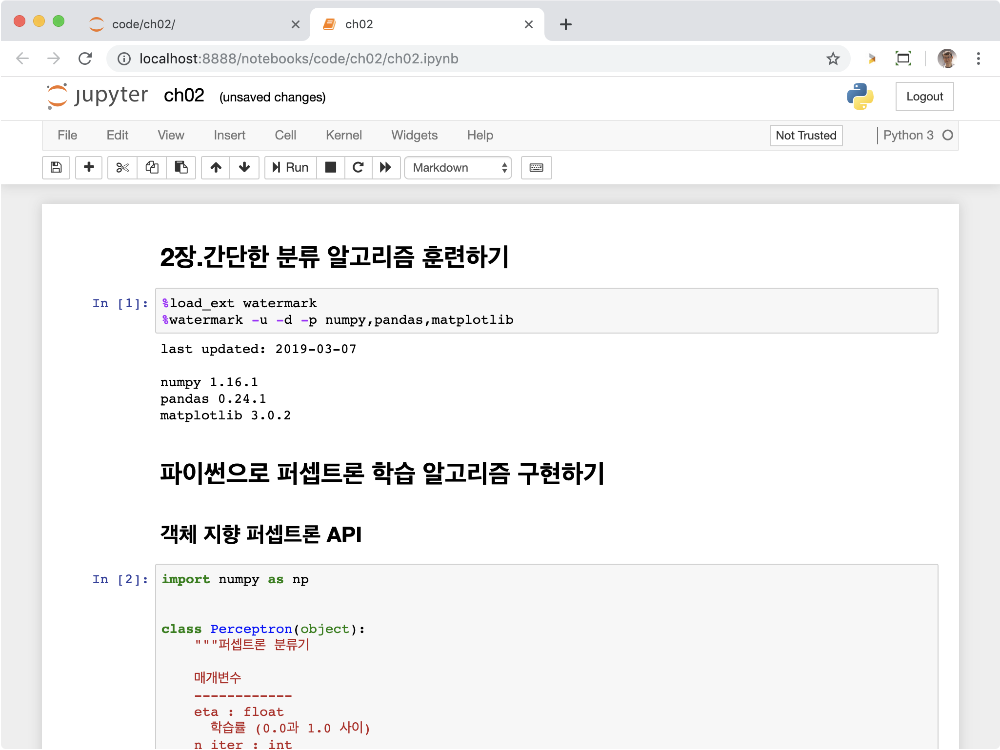

## 파이썬 패키지 설치

파이썬은 주요한 세 개의 운영체제 마이크로소프트 윈도, macOS, 리눅스를 모두 지원합니다. 설치 파일과 문서를 파이썬 공식 웹 사이트(https://www.python.org)에서 다운로드할 수 있습니다.

이 책은 파이썬 3.7 버전에 맞추어 작성되었습니다. 가능하면 최신 버전의 파이썬을 사용하는 것이 좋습니다. 하지만 아마도 파이썬 3의 이전 버전과 2.7.10 이상에서 실행할 수 있습니다. 파이썬 2.7을 사용하려면 파이썬 3과의 차이점에 대해 알고 있어야 합니다. 파이썬 3과 2.7 버전의 차이점을 다음 사이트에서 참고하세요. https://wiki.python.org/moin/Python2orPython3.

**노트**

현재 파이썬 버전을 확인하려면 다음 명령을 입력하세요.

    $ python -V

#### pip

이 책에서 사용하는 패키지는 `pip` 프로그램을 사용해 설치할 수 있습니다. 이 프로그램은 파이썬 3.3부터 표준 라이브러리에 포함되어 있습니다. pip에 관한 더 자세한 내용은 다음 사이트를 참고하세요. https://docs.python.org/3/installing/index.html.

파이썬을 설치한 후에 터미널에서 pip를 실행하여 파이썬 패키지를 설치할 수 있습니다:

    pip install SomePackage

(`SomePackage` 부분에 원하는 패키지 이름을 넣으세요. numpy, pandas, matplotlib, scikit-learn 등).

설치된 패키지를 업데이트하려면 `--upgrade` 옵션을 사용합니다:

    pip install SomePackage --upgrade

#### 아나콘다

과학 컴퓨팅을 위한 파이썬 배포판으로 많이 추천하는 것은 아나콘다입니다. 아나콘다는 무료이고 상용 제품이나 기업용으로 사용할 수 있습니다. 데이터 과학, 수학, 공학에 필요한 필수 파이썬 패키지를 다양한 플랫폼에 맞추어 기본으로 제공합니다. 아나콘다 설치파일은 https://www.anaconda.com/distribution/ 에서 다운받을 수 있습니다. 아나콘다 설치와 간단한 사용 방법은 부록 A를 참고하세요.

아나콘다를 설치한 후에 다음 명령으로 파이썬 패키지를 추가로 설치할 수 있습니다:

    conda install SomePackage

설치된 패키지는 다음 명령으로 업데이트합니다:

    conda update SomePackage

이 책에서는 데이터를 저장하고 조작하기 위해 주로 넘파이(numpy) 다차원 배열을 사용합니다. 이따금 넘파이를 기반으로 구축된 판다스(pandas)를 사용하겠습니다. 판다스는 데이터를 조작하는데 유용한 많은 도구를 제공하기 때문에 테이블 형식의 데이터를 다룰 때 편리합니다. 데이터를 시각화하고 직관적인 이해를 돕기위해 맷플롭립(matplotlib) 라이브러리를 사용합니다.

#### 핵심 패키지

이 책에서 사용하는 주요 파이썬 패키지의 버전은 다음과 같습니다. 코드가 올바르게 실행되려면 여러분이 사용하는 버전이 동일하거나 더 높아야 합니다:

- [NumPy](http://www.numpy.org) >= 1.16.3
- [SciPy](http://www.scipy.org) >= 1.2.1
- [scikit-learn](http://scikit-learn.org/stable/) >= 0.20.3
- [matplotlib](http://matplotlib.org) >= 3.0.3
- [pandas](http://pandas.pydata.org) >= 0.24.2

## 주피터 노트북

`.ipynb` 확장자를 가진 파일은 주피터 노트북 파일입니다. 이 책은 일반적인 파이썬 스크립트(`.py`)대신 주피터 노트북을 사용합니다. 주피터 노트북은 데이터 분석 프로젝트에서 아주 잘 맞습니다. 코드와 실행 결과, 그래프, 수식을 포함한 막다운(Markdown) 문서를 모두 한 파일에 저장할 수 있습니다!

`pip` 명령으로 주피터 노트북을 설치할 수 있습니다:

    $ pip install jupyter notebook

또는 아나콘다를 설치했다면 `conda` 명령으로 설치할 수 있습니다:

    $ conda install jupyter notebook

먼저 노트북 파일이 있는 디렉토리로 이동합니다.

    $ cd ~/code/python-machine-learning-book

그다음 `jupyter notebook` 명령을 실행합니다.

    $ jupyter notebook

주피터는 기본 브라우저를 실행하여 [http://localhost:8888/](http://localhost:8888/) 주소에 접속합니다.

원하는 노트북 파일을 찾아 더블 클릭하세요.

더 자세한 내용은 [주피터 노트북 가이드](https://jupyter-notebook-beginner-guide.readthedocs.io/) 문서를 참고하세요.